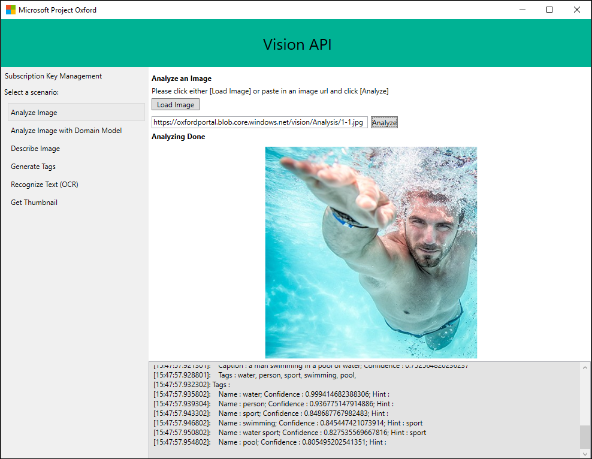

Microsoft Cognitive Services Video client SDK
===================================================

This repo contains the client libraries that demonstrate Microsoft’s cloud-based
video algorithms for tracking faces, detecting motion, and stabilizing video.
These APIs allow you to build more personalized and intelligent apps by understanding and automatically transforming your video content. See [our demo
page](<https://www.microsoft.com/cognitive-services/en-us/video-api>).

### Face Detection and Tracking
The Face Detection and Tracking video API provides high precision face location detection and tracking that can detect up to 64 human faces in a video. Frontal faces provide the best results, while side faces and small faces (smaller than or equal to 24x24 pixels) are challenging.

Face detection can be done by uploading an entire video file or by specifying the URL of an existing video on the web.

The detected and tracked faces are returned with coordinates (left, top, width, and height) indicating the location of faces in the image in pixels, as well as a face ID number indicating the tracking of that individual. Face ID numbers are prone to reset under circumstances when the frontal face is lost or overlapped in the frame.

For more details about how to use face detection and tracking, please refer to the [Video API reference guide](https://dev.projectoxford.ai/docs/services/565d6516778daf15800928d5/operations/565d6517778daf0978c45e39).

### Motion Detection
The Motion Detection API provides indicators once there are objects in motion in a fixed background video (e.g. a surveillance video). Motion Detection is trained to reduce false alarms, such as lighting and shadow changes. Current limitations of the algorithms include night vision videos, semi-transparent objects, and small objects.

Motion detection can be done by uploading an entire video file or by specifying the URL of an existing video on the web.

The output of this API is in JSON format, consisting of both time and duration of motion detected in the video.

For more details about how to use motion detection, please refer to the [Video API reference guide](https://dev.projectoxford.ai/docs/services/565d6516778daf15800928d5/operations/565d6517778daf0978c45e3a).

### Stabilization
The Stabilization API provides automatic video stabilization and smoothing for shaky videos. This API uses many of the same technologies found in [Microsoft Hyperlapse](http://research.microsoft.com/en-us/um/redmond/projects/hyperlapseapps/). Stabilization is optimized for small camera motions, with or without rolling shutter effects (e.g. holding a static camera, walking with a slow speed).

Stabilization can be done by uploading an entire video file or by specifying the URL of an existing video on the web.

The output of this API is in MP4 video format, consisting of the smoothed and stabilized version of the originally submitted video.

For more details about how to use video stabilization, please refer to the [Video API reference guide](https://dev.projectoxford.ai/docs/services/565d6516778daf15800928d5/operations/565d6517778daf0978c45e35).

### Video Thumbnail

The Video Thumbnail API provides an automatic motion thumbnail summary for videos to let people see a preview or snapshot quickly. A selection of scenes from a video is used to create a preview in the form of a short video.

Video Thumbnail can be done by uploading an entire video file or by specifying the URL of an existing video on the web.

For more details about how to use video thumbnail, please refer to the [Video API reference guide](https://dev.projectoxford.ai/docs/services/565d6516778daf15800928d5/operations/56f8acb0778daf23d8ec6738).

The client library
==================

The Vision API client library is a thin C\# client wrapper for Microsoft Cognitive Services (formerly Project Oxford) Vision
REST APIs.  

The easiest way to use this client library is to get microsoft.projectoxford.vision package from [nuget](<http://nuget.org>).

Please go to [Vision API Package in nuget](https://www.nuget.org/packages/Microsoft.ProjectOxford.Vision/) for more details.

The sample
==========

This sample is a Windows WPF application to demonstrate the use of Microsoft Cognitive Services (formerly Project Oxford) Vision API.

Build the sample
----------------

1.  Starting in the folder where you clone the repository (this folder)

2.  In a git command line tool, type `git submodule init` (or do this through a UI)

3.  Pull in the shared Windows code by calling `git submodule update`

4.  Start Microsoft Visual Studio 2015 and select `File > Open >
    Project/Solution`.

5.  Starting in the folder where you clone the repository, go to `Vision > Windows
    > Sample-WPF` Folder.

6.  Double-click the Visual Studio 2015 Solution (.sln) file
    VisionAPI-WPF-Samples.

7.  Press Ctrl+Shift+B, or select `Build > Build Solution`.

Run the sample
--------------

After the build is complete, press F5 to run the sample.

First, you must obtain a Vision API subscription key by following instructions in [Microsoft Cognitive Services subscription](<https://www.microsoft.com/cognitive-services/en-us/sign-up>).

Locate the text edit box saying "Paste your subscription key here to start" on
the top right corner. Paste your subscription key. You can choose to persist
your subscription key in your machine by clicking "Save Key" button. When you
want to delete the subscription key from the machine, click "Delete Key" to
remove it from your machine.

Microsoft will receive the images you upload and may use them to improve Vision
API and related services. By submitting an image, you confirm you have consent
from everyone in it.

Contributing
============
We welcome contributions and are always looking for new SDKs, input, and
suggestions. Feel free to file issues on the repo and we'll address them as we can. You can also learn more about how you can help on the [Contribution
Rules & Guidelines](</CONTRIBUTING.md>).

For questions, feedback, or suggestions about Microsoft Cognitive Services, feel free to reach out to us directly.

-   [Cognitive Services UserVoice Forum](<https://cognitive.uservoice.com>)

License
=======

All Microsoft Cognitive Services SDKs and samples are licensed with the MIT License. For more details, see
[LICENSE](</LICENSE.md>).

Sample images are licensed separately, please refer to [LICENSE-IMAGE](</LICENSE-IMAGE.md>).
